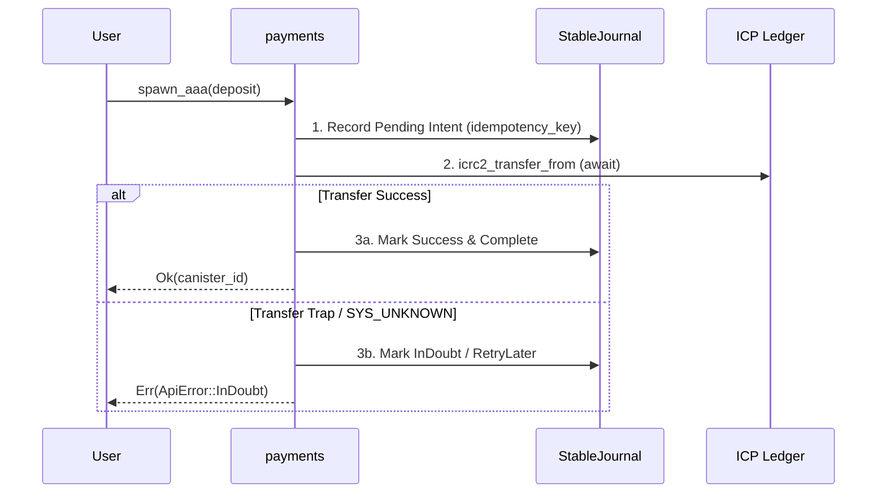

# agent-saga-journal

> Journal transaction intent in stable storage before awaiting external canisters to guarantee recovery

## Why It Matters

When an inter-canister call fails due to a network timeout, subnetwork restart, or `SYS_UNKNOWN`, the local canister cannot know whether the remote action completed. If state is only updated after the await, funds or tasks can become permanently stranded.

Writing an idempotent intent record (a saga journal) to stable memory **before** issuing the external call ensures that:
1. Re-running the method detects the pending intent and checks the remote status rather than repeating the transfer.
2. A periodic background timer sweep can safely resume or refund uncompleted operations.

## Saga Pattern



## Good

```rust
// 1. Record intent BEFORE the call
let tx_id = state::journal_pending_op(&caller, &op_intent)?;

// 2. Call external canister
match ic_cdk::call(ledger_id, "icrc2_transfer_from", (args,)).await {
    Ok((Ok(block_index),)) => {
        state::journal_mark_completed(tx_id, block_index);
        Ok(block_index)
    }
    Ok((Err(ledger_err),)) => {
        state::journal_mark_failed(tx_id, ledger_err);
        Err(ApiError::LedgerError(ledger_err))
    }
    Err((code, msg)) => {
        // SYS_UNKNOWN: do not assume failure; sweep timer will query outcome
        state::journal_mark_indoubt(tx_id, code, msg);
        Err(ApiError::TransactionInDoubt)
    }
}
```

## See Also

- [agent-caller-guard](./agent-caller-guard.md) - Reentrancy prevention
- [agent-bounded-wait](./agent-bounded-wait.md) - Inter-canister timeouts
