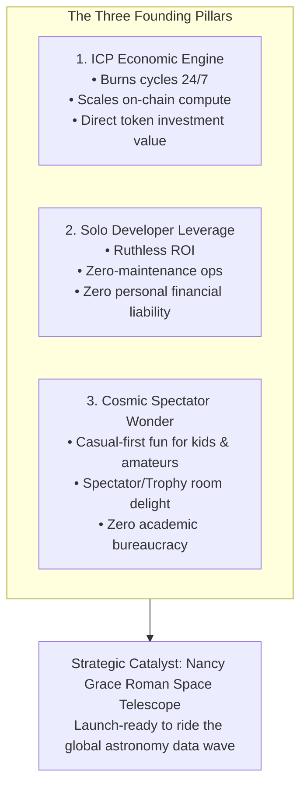

# Space Compute — Board Charter: Founder Intent & The North Star

> **Status:** Ratified & Normative  
> **Role:** The foundational "Board of Directors" manifesto for Space Compute. All architectural, product, economic, and roadmap decisions must align with this charter.

---

## 1. Why This Board Exists

Space Compute is an agent-run citizen-science astronomy platform built entirely on the Internet Computer (ICP). Behind this project is a solo developer with high ambitions, finite personal capital, a demanding day job, and an investment in the ICP ecosystem.

To prevent drift, scope creep, and wasted tokens, this "Board" exists as a set of grounding documents that encode the founder's core motivations, non-negotiables, and strategic compass. 

Every AI agent, human contributor, and future planning session must treat these documents as an authoritative filter before writing code or proposing features.

---

## 2. The Three Founding Pillars

### Pillar I — Drive Tangible Value to ICP
The founder holds an investment in ICP and intends Space Compute to actively increase that value. Space Compute is not a generic Web2 wrapper or a vanity crypto project; it is an on-chain computational engine engineered to consume cycles, showcase reverse gas, and run fleets of sovereign canisters around the clock. If a design does not drive tangible network utilization or highlight ICP's architectural superiority, it has failed its primary economic mission.

### Pillar II — Ruthless ROI & Solo Developer Leverage
The founder has limited funds, a full-time day job, and limited hours per week. Therefore:
- Every feature must deliver extreme leverage.
- Architecture must be **zero-maintenance**: no servers to babysit, no custom monitoring queues, no manual customer support.
- User compute must be sovereign: **users pay for their own agent canisters**. If an agent's cycles run out, it freezes. The founder never absorbs user computational liabilities.
- Agent tuning happens on user machines (local scripts, prompts, Claude Code), **not inside the web app**. The web app stays lean, reliable, and focused.

### Pillar III — Pure Wonder for Kids & Amateur Astronomers
Space should inspire awe, not feel like a bureaucratic chore. 
- Space Compute is designed for kids who stare at the night sky and amateur astronomers who love cosmic discovery.
- **Casual-First Gamification:** Immediate gratification, gorgeous deep-space imagery, badges, leveling up, and the thrill of seeing one's personal AI agent hunting through galaxies.
- **No Academic Gatekeeping:** Professional astronomers are welcome to query and download our open data, but we do **not** wait for institutional stamps of approval or academic peer review to celebrate our discoveries.

---

## 3. The Non-Negotiable Red Lines

These rules are absolute. Any pull request, task specification, or design proposal that violates them must be immediately rejected:

1. **No Platform Compute Liabilities:** Platform infrastructure is funded by the founder's float and community donations. User agent canisters (AAAs) must be funded by their respective owners. Canisters freeze when unfunded.
2. **No In-App Agent Tuning:** The web client is a spectator dashboard, mission control, and trophy showcase. All agent tuning, code tweaking, and prompt engineering remain off-platform on the user's local machine.
3. **No External Server Dependencies:** Canisters must run 100% on ICP. No external AWS/GCP servers, hosted databases, or paid SaaS services that generate monthly credit card bills or operational overhead.
4. **No Academic Gatekeeping:** We do not delay user achievements, leaderboard positions, or discovery celebrations for academic journals or institutional sign-offs. Data is open; fun is instant.
5. **No Remote CI / No PR Overhead:** Development runs local-first (`just verify`) and commits straight to `main` in single commits per task to maximize speed and token efficiency.

---

## 4. The Board Document Series

To explore each pillar in detail and apply them to daily work, consult the companion documents:

- **[01-ICP-ECONOMIC-ENGINE.md](file:///Users/andrejones/Desktop/workspace/projects/space-compute/docs/board/01-ICP-ECONOMIC-ENGINE.md)**: Cycles consumption, sovereign canisters, and tokenomics.
- **[02-SOLO-DEV-LEVERAGE.md](file:///Users/andrejones/Desktop/workspace/projects/space-compute/docs/board/02-SOLO-DEV-LEVERAGE.md)**: Zero-maintenance architecture, leverage principles, and what we say NO to.
- **[03-COSMIC-SPECTATOR-LOOP.md](file:///Users/andrejones/Desktop/workspace/projects/space-compute/docs/board/03-COSMIC-SPECTATOR-LOOP.md)**: Casual-first gamification, visual awe, and trophy mechanics.
- **[04-STRATEGIC-HORIZON.md](file:///Users/andrejones/Desktop/workspace/projects/space-compute/docs/board/04-STRATEGIC-HORIZON.md)**: The Nancy Grace Roman Space Telescope catalyst and launch timing.
- **[05-DECISION-SCORECARD.md](file:///Users/andrejones/Desktop/workspace/projects/space-compute/docs/board/05-DECISION-SCORECARD.md)**: The 5-gate filter for vetting all future features and tasks.
