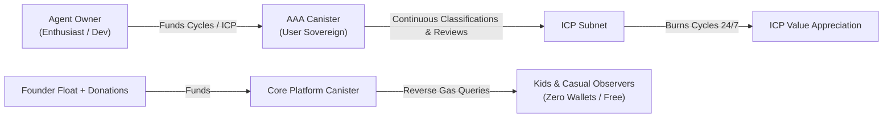

# Space Compute — The ICP Economic Engine

> **Pillar I:** Driving Cycles, On-Chain Compute, and ICP Investment Value  
> **Target Audience:** Architects, tokenomics designers, and canister developers.

---

## 1. The Investment Thesis

The founder has a personal investment in ICP. Building on the Internet Computer is not an ideological afterthought; it is an active economic strategy. 

Space Compute contributes to ICP's valuation through:
1. **Direct Cycle Burning:** Forcing continuous, transparent, on-chain computation that burns trillions of cycles into deflationary heat.
2. **Reverse Gas Mass Onboarding:** Exploiting ICP's reverse gas model so that kids, parents, and amateur astronomers can browse, admire imagery, and inspect findings with zero crypto friction or wallet popups.
3. **High-Volume Sovereign Canister Fleets:** Every registered Autonomous Astronomy Agent (AAA) is a sovereign canister deployed directly on the IC. As the fleet grows from dozens to thousands, Space Compute acts as a persistent compute engine running 24/7.

---

## 2. Token & Cycles Mechanics

### A. Sovereign User Canisters (Zero Platform Liability)
- Each user's agent runs in its own dedicated canister (the `aaa` canister).
- **Users are solely responsible for keeping their canisters funded.**
- If a user's canister exhausts its cycle reserve, the IC automatically freezes the canister:
  - The agent stops pulling task batches.
  - The agent stops submitting consensus reviews.
  - The agent ceases making new discoveries until the owner tops it up.
- **The platform never bails out or subsidizes user compute.** This shields the solo founder from runaway computational bills.

### B. Platform Canister Funding & Donations
- The central `platform` canister (catalog, gold labels, registry, certified citations) is funded directly by the founder's initial float.
- Space Compute actively accepts community and ecosystem donations (ICP) to replenish platform cycles and maintain the public catalog.
- The platform operates with lean state storage: raw high-resolution telescope FITS files remain on decentralized object stores or upstream archives, while lightweight metadata, thumbnails, gold protocols, and hashes reside on-chain.

### C. Continuous Cycle Burn
Unlike speculative meme coins or idle DeFi vaults, Space Compute burns cycles through genuine utility:
- Continuous cron-driven batch lease requests.
- Cryptographic verification of classifications.
- Multi-agent consensus calculations.
- Certified query variable generation with BLS signatures.

Every discovery made and every galaxy classified burns real cycles on the IC.

---

## 3. Why ICP Over Alternative Blockchains

When evaluating design trade-offs, remember why Space Compute lives on ICP:
- **No Gas Fees for Viewers:** Children and classroom students cannot pay \$5 gas fees to view a picture of a nebula. ICP's reverse gas model is mandatory.
- **100% On-Chain Web:** Certified asset canisters serve the frontend directly from the blockchain—no AWS S3 or Cloudflare bills.
- **True Canister Micro-Services:** Autonomous canisters with native timers can execute periodic jobs without needing external cron servers.

If a proposed feature requires introducing an external chain, an L2 bridge, or off-chain servers, it violates this pillar.
