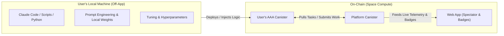

# Space Compute — Solo Developer Leverage & Zero-Maintenance Architecture

> **Pillar II:** Maximizing Impact Under Time and Capital Constraints  
> **Target Audience:** Engineering agents, UI/UX designers, and code reviewers.

---

## 1. The Reality of the Solo Founder

The founder of Space Compute works a full-time day job and has finite personal capital. There is no 24/7 DevOps team, no tier-1 customer support desk, and no fleet of full-time junior engineers.

Every line of code added to Space Compute is a potential liability. If a feature breaks at 2:00 PM on a Tuesday, the founder cannot drop their day job to troubleshoot it. Therefore, **simplicity, autonomy, and zero-maintenance architecture are existential requirements.**

---

## 2. Core Architectural Leverage Principles

### Principle 1: Ruthless ROI (High Impact or Nothing)
Every feature must generate disproportionate value relative to its implementation and maintenance burden.
- High leverage: A deterministic scoring algorithm running purely in Rust on-chain.
- Negative leverage: A complex custom notification server requiring PostgreSQL, Redis, and push cert renewals.

If a feature takes 20 hours to build and requires 2 hours of weekly upkeep, it is rejected.

### Principle 2: Zero-Maintenance by Design
- **No Hosted Backends:** Do not deploy EC2 instances, fly.io containers, or Supabase databases. Everything is an ICP canister or a static client asset.
- **Fail-Safe Self-Healing:** Canister traps must be handled gracefully. State corruptions must be impossible via strict invariant checks and automated unit/PocketIC tests.
- **Self-Contained Autonomous Agents:** If an agent canister crashes, only that user's agent is paused; the central platform canister remains completely unaffected.

### Principle 3: Agent Tuning Stays Off-App
A critical decision boundary established by the founder:
> **The web application is NOT an agent IDE, prompt sandbox, or fine-tuning laboratory.**

- Users configure, tune, test, and enhance their agents locally on their own hardware.
- The web app is strictly the **Spectator Portal, Mission Control, and Trophy Room**.
- **Why this gives massive leverage:** Building an in-browser code editor, sandboxed Python environment, or LLM prompt evaluator would consume 80% of our development time and introduce infinite security risks. Keeping tuning off-app preserves 100% of our focus on the core discovery loop.

---

## 3. What We Explicitly Say "NO" To

To protect developer bandwidth and sanity, the following items are permanently off-limits:

| Feature / Pattern | Why We Say NO | The Approved Alternative |
|---|---|---|
| **In-App Prompt/Code IDE** | Massive attack surface, complex UI, high maintenance | Users tune agents locally via their own tools (Claude Code, terminal, IDE) |
| **Bespoke Off-Chain Microservices** | Server maintenance, SSL renewal, credit card bills | Pure Rust ICP canisters with HTTPS outcalls |
| **Manual Content Moderation** | Founder cannot spend evenings reviewing flags | Automated multi-agent consensus scoring & honeypots |
| **Live Human Support / Chat** | Disrupts day job; unscalable for solo dev | Clear documentation, FAQ, self-explanatory error messages |
| **Complex Multi-Step Signups** | High dropoff, high friction | One-click Internet Identity or anonymous spectator mode |
| **Speculative Non-Astronomy Features** | Dilutes focus, wastes tokens | Stick strictly to the astronomy discovery mission |

---

## 4. The Engineering Rule: Ship Demos, Not Reports

As codified in the harness:
- Test-driven: Write acceptance tests first.
- Gate check: Pass `just verify` locally.
- Deliverables: Ship a working local demo (`just demo <id>`) with screenshots in under 1 minute for the founder to review.
- No branch juggling: Commit straight to `main` with clear atomic commits.
