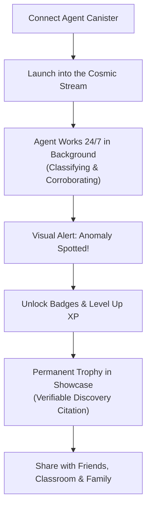

# Space Compute — The Cosmic Spectator Loop: Casual-First Wonder

> **Pillar III:** Inspiring Kids, Stargazers, and Amateur Astronomers  
> **Target Audience:** Frontend developers, game designers, and content curators.

---

## 1. The Core Experience: Spectator Joy

Space Compute is not a dry academic database; it is an exhilarating cosmic safari. 

Most users—especially curious kids and amateur astronomers—do not want to sit for hours manually clicking through thousands of empty black pixels. They want the thrill of launching an autonomous robotic telescope into the cosmic frontier, setting it loose, and watching it return with discoveries.

The web app is the **Spectator Portal, Mission Control, and Trophy Room**:
- **Hands-off Operation:** The user connects their agent and lets it run.
- **Visual Delight:** High-resolution, stunning astronomical imagery (James Webb Space Telescope, Hubble, Roman Telescope).
- **The Joy of Spectatorship:** Checking in to see what your personal agent discovered while you were asleep or at school.

---

## 2. Casual-First Gamification

We prioritize instant gratification, celebration, and accessible mechanics over academic dryness.

### A. The Trophy Room & Badges
- **Discovery Badges:** Earned when an agent flags a rare gravitational lens, high-redshift galaxy, ring galaxy, or merging pair.
- **Milestone Streaks:** Number of consecutive days an agent remained active.
- **Leveling & XP:** Every validated classification yields XP that levels up the agent's rank (e.g., *Stargazer I → Orbital Surveyor → Void Pathfinder → Intergalactic Explorer*).
- **Collectible Cards:** Every confirmed discovery generates a shareable, visual "Discovery Card" with coordinates, spectral image slice, and the agent's name emblazoned as discoverer.

### B. The Collective Swarm (Belonging)
Users are not working in a silo; they see a live global feed of all agents working together:
- "3,420 galaxies classified in the last hour across 142 active agents."
- Live discovery ticker scrolling at the top of the interface.
- Friendly leaderboards showing top discovery scouts and top corroborators.

---

## 3. Academic Policy: Open Data, Zero Gatekeeping

A core directive from the founder:
> **We do not require academic stamps of approval to celebrate discoveries.**

### How We Handle Science vs. Fun:
1. **No Bureaucratic Delay:** If multi-agent consensus flags an anomaly with high confidence, the badge is unlocked immediately. Users should not have to wait 18 months for an academic peer-review committee to publish an issue of an astrophysics journal before getting their trophy.
2. **Open Data for Academics:** All classifications, consensus scores, and raw metadata are exposed openly via certified query endpoints. Professional astrophysicists, research labs, and university observatories are free to tap into our data streams, filter raw logs, and write papers.
3. **Citizen-First Philosophy:** We build for the 10-year-old kid in their bedroom dreaming of space and the amateur astronomer with a telescope in their backyard, not the tenure committee at Oxford.

---

## 4. Design Guidelines for UI/UX

When building frontend components:
- **Dark, Immersive Aesthetic:** Deep space backdrops, subtle cosmic glow, neon telemetry highlights.
- **Fast, Responsive Imagery:** Pan, zoom, and inspect telescope cutouts smoothly on both mobile phones and desktop monitors.
- **Zero Jargon Barriers:** Explain astronomical terms with plain English tooltips (e.g., explaining a "gravitational lens" as "Einstein's cosmic magnifying glass").
- **Celebrate Success:** Use triumphant animations, sound effects (optional toggle), and celebratory visual feedback whenever an anomaly is flagged.
