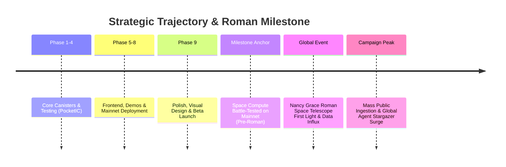

# Space Compute — Strategic Horizon: The Nancy Grace Roman Telescope Catalyst

> **Strategic Objective:** Launch readiness and positioning ahead of the Nancy Grace Roman Space Telescope data wave.  
> **Target Audience:** Product managers, roadmap planners, and data curation engineers.

---

## 1. The Strategic Catalyst

In modern astronomy, public excitement follows telescope first-light events. The launch of the James Webb Space Telescope (JWST) captivated hundreds of millions worldwide. 

The next colossal milestone in global astrophysics is NASA's flagship **Nancy Grace Roman Space Telescope (NGRST)**.

### Why Nancy Grace Roman is a Game Changer:
1. **100x Wider Field of View:** While Hubble and Webb take exquisite deep-field "pinhole" shots, Roman captures panoramic swaths of the sky that are **100 times larger than Hubble's field of view** with the same sharpness.
2. **Massive Data Deluge:** Roman will generate petabytes of new astronomical imagery—far more data than professional human astronomers could ever manually examine in lifetimes.
3. **Massive Media Spotlight:** Every news network, science publication, and school curriculum will be covering Roman's launch, first-light images, and mission discoveries.

---

## 2. The Operational Goal: Be Battle-Tested in Advance

The founder's explicit requirement:
> **Space Compute must be 100% operational, battle-tested, and live on mainnet in advance of Roman telescope data releases.**

If we are still debugging core canisters or scrambling to fix frontend crashes when Roman data drops, we miss the single biggest marketing catalyst of the decade.

### Key Milestones for Roman Readiness:

| Stage | Objective | Deliverables |
|---|---|---|
| **Stage 1: Stable Foundation** | Core platform, payments, and AAA canisters deployed on mainnet | Fully passing `just verify`, zero high-severity vulnerabilities |
| **Stage 2: Curated Pipeline** | Data curation pipeline capable of ingesting public FITS/cutouts | Tested ingestion scripts for NASA/STScI public archives |
| **Stage 3: Fleet Simulation** | Hundreds of test agent canisters running stress-tests | High-throughput batch lease and consensus verified under load |
| **Stage 4: Launch & Press Blitz** | Public launch timed with Roman data announcements | Press releases, ICP community showcases, social media galaxy hunts |

---

## 3. Marketing & Distribution Strategy

When Roman data releases begin:
- **"Be the First Mind to See This Galaxy":** Position Space Compute as the platform where kids, amateur astronomers, and hobbyist coders can point their own autonomous agents at freshly delivered Roman sky surveys.
- **School & Club Campaigns:** Outreach to high school astronomy clubs, amateur stargazing societies, and coding meetups. Give them a turnkey skill/script to deploy an agent and watch it explore.
- **ICP Ecosystem Showcase:** Highlight to the ICP community and DFINITY that Space Compute is processing petabyte-scale NASA astronomy data entirely on the Internet Computer with zero cloud server bills.
- **Donation Inflows:** Leverage the media attention to solicit community donations to the platform treasury, keeping public reverse-gas queries permanently solvent.
