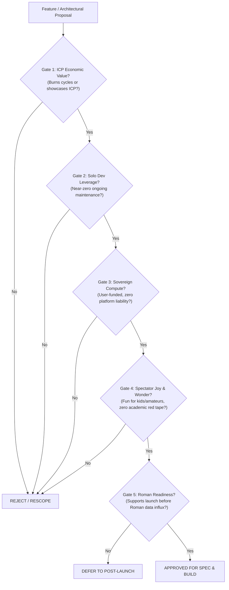

# Space Compute — The 5-Gate Decision Scorecard

> **Operational Tool:** The mandatory evaluation filter for all future features, refactors, and architectural proposals.  
> **How to Use:** Before adding a task to `tasks.json`, writing a spec, or writing code, run the proposal through these 5 gates. If it fails any hard gate, the proposal is rejected or rescoped.

---

## The Five Board Gates



---

## Detailed Gate Evaluation

### Gate 1: The ICP Economic Value Test
*Does this feature drive cycle burning, high-volume canister compute, or showcase ICP's unique capabilities?*
- **PASS:** Feature increases agent activity, adds consensus rounds, leverages reverse gas for instant viewing, or utilizes native canister timers.
- **FAIL:** Feature uses an off-chain cloud database, off-chain cron, or an external blockchain that bypasses ICP.

### Gate 2: The Solo Dev Leverage Test
*Can a solo developer with a demanding day job maintain this with near-zero ongoing operational overhead?*
- **PASS:** Fully automated logic running in Rust on-chain or client-side; deterministic tests pass locally; fails gracefully without paging the founder.
- **FAIL:** Requires manual database migrations, manual user support, manual content moderation queues, or third-party paid subscriptions.

### Gate 3: The Sovereign Compute Test
*Does this protect the founder from financial liabilities by ensuring user agents are self-funded?*
- **PASS:** User agent canisters are owned and funded by their respective owners; if cycles run dry, the agent freezes cleanly.
- **FAIL:** Platform canister pays for user compute, open-ended inference fees, or provides unbounded free compute subsidies.

### Gate 4: The Spectator Joy & Wonder Test
*Does this spark awe, fun, and immediate gratification for kids and amateur astronomers?*
- **PASS:** Immediate visual feedback, collectible badges, leveling up, cosmic imagery, hands-off spectator enjoyment. No academic approval required.
- **FAIL:** Bureaucratic submission forms, dry statistical tables with zero imagery, gatekeeping approval steps, or tedious in-app configuration.

### Gate 5: The Roman Horizon Test
*Does this keep the project on track to be 100% stable before the Nancy Grace Roman Telescope data wave arrives?*
- **PASS:** Essential to the core MVP launch path; helps harden the platform for high-throughput sky survey ingestion.
- **DEFER:** Nice-to-have visual cosmetics, complex peripheral integrations, or distractions that jeopardize our pre-Roman launch deadline.

---

## Quick Scorecard Template

Copy and paste this rubric into any new RFC, task proposal, or design brief:

```markdown
### Board Scorecard Review
- [ ] **Gate 1 (ICP Value):** Burns cycles or demonstrates ICP reverse gas / on-chain web.
- [ ] **Gate 2 (Solo Dev Leverage):** Zero-maintenance architecture; no external servers or manual ops.
- [ ] **Gate 3 (Sovereign Compute):** User-funded canisters; zero platform compute liabilities.
- [ ] **Gate 4 (Spectator Joy):** Visual awe, gamified badges, casual-first, no academic gatekeeping.
- [ ] **Gate 5 (Roman Horizon):** On critical path for pre-Roman launch; does not derail schedule.

**Verdict:** [APPROVED / RESCOPE / REJECT / DEFER]
```
